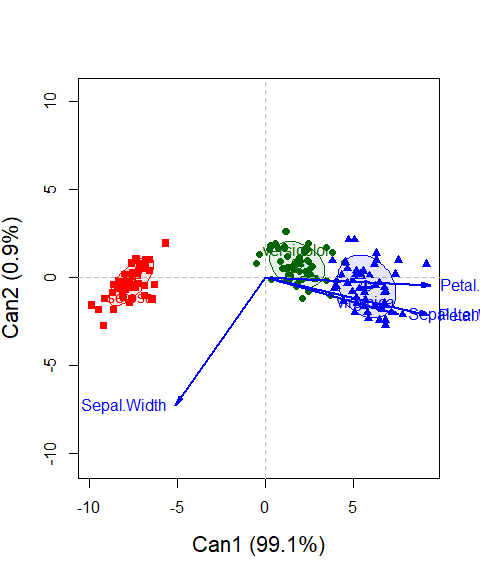
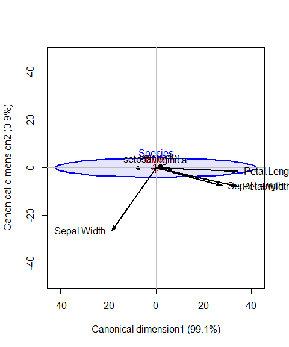

<!-- README.md is generated from README.Rmd. Please edit that file and knit again -->

<!-- badges: start -->

[](https://lifecycle.r-lib.org/articles/stages.html#stable)
[](https://cran.r-project.org/package=candisc)
[](https://friendly.r-universe.dev)
[](https://cran.r-project.org/package=candisc)
[](https://friendly.github.io/candisc/)

<!-- badges: end -->

# candisc 

**Visualizing Generalized Canonical Discriminant and Canonical
Correlation Analysis**

Version 1.1.0

<!-- when in Rmd format, can use
Version 1.1.0
-->

## Description

This package includes functions for computing and visualizing
generalized canonical discriminant analyses and canonical correlation
analysis for a multivariate linear model (MLM). The goal is to provide
ways of visualizing such models in a low-dimensional space corresponding
to dimensions (linear combinations of the response variables) of maximal
relationship to the predictor variables.

Traditional canonical discriminant analysis is restricted to a one-way
MANOVA design and is equivalent to canonical correlation analysis
between a set of quantitative response variables and a set of dummy
variables coded from the factor variable. The `candisc` package
generalizes this to multi-way MANOVA designs for all terms in a
multivariate linear model (i.e., an `mlm` object), computing canonical
scores and vectors for each term (giving a `"candiscList"` object).

For `mlm`s with more than a few response variables, these methods often
provide a much simpler interpretation of the nature of effects in low-D
*canonical space* than heplots for pairs of responses or an HE plot
matrix of all responses in *variable space*.

The `candisc` package originated as a low-D cousin of the [heplots
package](https://friendly.github.io/heplots/index.html), designed to
provide visualization methods in low-dimensional space.

### Visualization methods

The graphic functions are designed to provide low-rank (1D, 2D, 3D)
visualizations of terms in a `"mlm"` via the `plot.candisc()` method,
which plots the observations in *canonical space*, together with
**variable vectors** showing the relations of the response `y` variables
to the canonical variables `Can1`, `Can2`. This is the same idea as that
of a **biplot** (Gabriel, 1971).

The HE plot `heplot.candisc()` and `heplot3d.candisc()` methods use a
similar framework, but replace the observations and groupwise data
ellipses in the plot with representations of the **H** ellipsoid,
representing between-group variation in the means and the **E**
ellipsoid reflecting the pooled within-group variation.

Analogously, a multivariate linear (regression) model with quantitative
predictors can also be represented in a reduced-rank space by means of a
canonical correlation transformation of the Y and X variables to
*uncorrelated* **canonical variates**, named with the prefix `Ycan` and
`Xcan`. Computation for this analysis is provided by `cancor()` and
related methods. Visualization of these results in canonical space are
provided by the `plot.cancor()`, `heplot.cancor()` and
`heplot3d.cancor()` methods.

### Variable ordering

The relations among response variables in linear models can also be
useful for “effect ordering” (Friendly & Kwan (2003)) for *variables* in
other multivariate data displays, such as heatmaps or “corrgrams”
(Friendly, 2002) of correlations. to make the displayed relationships
more coherent. The function `varOrder()` implements a collection of
these methods.

### Discriminant analysis

Some of these visualization methods have now been extended to linear and
quadratic discriminant analysis, using `MASS:lda()` or `MASS:qda()`.

- Provides a simplified interface to prediction, in `predict_discrim()`.
- A new plotting method, `plot_discrim()`, provides `ggplot2` plots of
  the classification regions and decision boundaries in data space and
  in discriminant space.
- `cor_lda()` calculates correlations between the observed variables and
  the discriminant dimensions.

## Installation

The current official release of the `candisc` package can be installed
from CRAN. The most recent development version can be installed from
R-universe or this Github repo.

|  |  |
|----|----|
| CRAN version | `install.packages("candisc")` |
| R-universe | `install.packages('candisc', repos = c('https://friendly.r-universe.dev')` |
| GitHub version | `remotes::install_github("friendly/candisc")` |

## Vignettes

- A new vignette, `vignette("diabetes", package="candisc")`, illustrates
  some of the methods of this package, with a dataset on forms of
  diabetes.

- Another vignette, `vignette("painters", package="candisc")`, applies
  these methods to a dataset on the aesthetic ratings of classical
  painters.

- A more comprehensive collection of examples, illustrating multivariate
  regression and MANOVA methods, is contained in the vignettes for the
  `heplots` package. Use `browseVignettes(package = "heplots")` to see
  them all.

  - [HE plot MANOVA
    Examples](https://friendly.github.io/heplots/articles/HE_manova.html)
  - [HE plot MMRA
    Examples](https://friendly.github.io/heplots/articles/HE_mmra.html)

## Examples

These examples will get you started.

### Iris data

Using the `iris` data, fit the multivariate model for `Species`. You can
feed this to `candisc()` to get the canonical discriminant equivalent.

``` r
iris.mod <- lm(cbind(Petal.Length, Sepal.Length, Petal.Width, Sepal.Width) ~ Species, data=iris)
car::Anova(iris.mod)
#> 
#> Type II MANOVA Tests: Pillai test statistic
#>         Df test stat approx F num Df den Df    Pr(>F)    
#> Species  2    1.1919   53.466      8    290 < 2.2e-16 ***
#> ---
#> Signif. codes:  0 '***' 0.001 '**' 0.01 '*' 0.05 '.' 0.1 ' ' 1

iris.can <- candisc(iris.mod, data=iris)
iris.can
#> 
#> Canonical Discriminant Analysis for Species:
#> 
#>    CanRsq Eigenvalue Difference  Percent Cumulative
#> 1 0.96987   32.19193     31.907 99.12126     99.121
#> 2 0.22203    0.28539     31.907  0.87874    100.000
#> 
#> Test of H0: The canonical correlations in the 
#> current row and all that follow are zero
#> 
#>   LR test stat approx F numDF denDF   Pr(> F)    
#> 1      0.02344  199.145     8   288 < 2.2e-16 ***
#> 2      0.77797   13.794     3   145 5.794e-08 ***
#> ---
#> Signif. codes:  0 '***' 0.001 '**' 0.01 '*' 0.05 '.' 0.1 ' ' 1
```

This says that although there are 4 dimensions in the `iris` data, only
two are needed to fully account for the differences among the group
means relative to within-group variation. Both are significant by the
likelihood ratio tests, but the first accounts for 99.1% of these
differences.

Methods are available to extract coefficients (`coef()`) and scores of
observations on the canonical dimensions (`scores()`).

``` r
# get coefficients
coef(iris.can)
#>                    Can1        Can2
#> Petal.Length  0.9472572  0.40103782
#> Sepal.Length -0.4269548 -0.01240753
#> Petal.Width   0.5751608 -0.58103986
#> Sepal.Width  -0.5212417 -0.73526131

scores(iris.can) |> str()
#> 'data.frame':    150 obs. of  3 variables:
#>  $ Species: Factor w/ 3 levels "setosa","versicolor",..: 1 1 1 1 1 1 1 1 1 1 ...
#>  $ Can1   : num  -8.06 -7.13 -7.49 -6.81 -8.13 ...
#>  $ Can2   : num  -0.3 0.787 0.265 0.671 -0.514 ...
```

Correlations between the observed variables and the canonical dimensions
are given by the `$structure` component of the object.

``` r
iris.can$structure
#>                    Can1        Can2
#> Petal.Length  0.9849513 -0.04603709
#> Sepal.Length  0.7918878 -0.21759312
#> Petal.Width   0.9728120 -0.22290236
#> Sepal.Width  -0.5307590 -0.75798931
```

### Plotting methods

The basic plot for a `"candisc"` object is a scatterplot of the
`scores()name` for the observations on the canonical variates, which are
the linear combinations of the observed variables. For ease of
interpretation, it plots vectors for the responses in the model showing
their structure correlations with the canonical dimension.

The following plot illustrates some of the options.

``` r
#-- assign colors and symbols corresponding to species
iris.colors <- c("red", "darkgreen", "blue")
iris.pch <- 15:17
plot(
  iris.can, 
  col = iris.colors,
  pch = iris.pch,
  ellipse = TRUE,
  var.lwd = 2,
  cex.lab = 1.4)
```

<!-- -->

The `heplot()` method for a “candisc” object replaces the individual
scores by a **H** ellipse showing variation of the means and an **E**
ellipse reflecting the pooled within-group variation.

``` r
heplot(
  iris.can,
  fill = TRUE, fill.alpha = 0.1,
  prefix = "Canonical dimension",
  var.col = "black",
  var.lwd = 2,
  scale = 35,
  lab.cex = 1.25)
```

<!-- -->

## Citation

To cite package `candisc` in publications use:

Friendly M., Fox J. (2025). candisc: Visualizing Generalized Canonical
Discriminant and Canonical Correlation Analysis\_. R package version
1.0.0, <https://CRAN.R-project.org/package=heplots>.

For the theory on which these methods are based, also cite:

Friendly, M. (2007). “HE plots for Multivariate General Linear Models.”
*Journal of Computational and Graphical Statistics*, *16*(2), 421-444.
<https://doi.org/10.1198/106186007X208407>.

## References

Friendly, M. (2002). Corrgrams: Exploratory displays for correlation
matrices. *The American Statistician*, **56**(4), 316–324.
<https://doi.org/10.1198/000313002533>

Friendly, M., & Kwan, E. (2003). Effect Ordering for Data Displays.
*Computational Statistics and Data Analysis*, **43**(4), 509–539.
<https://doi.org/10.1016/S0167-9473(02)00290-6>

Gabriel, K. R. (1971). The Biplot Graphic Display of Matrices with
Application to Principal Components Analysis. *Biometrics*, **58**(3),
453–467.
