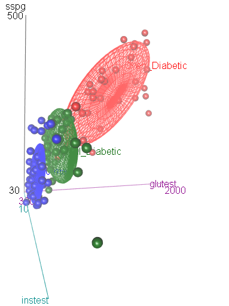
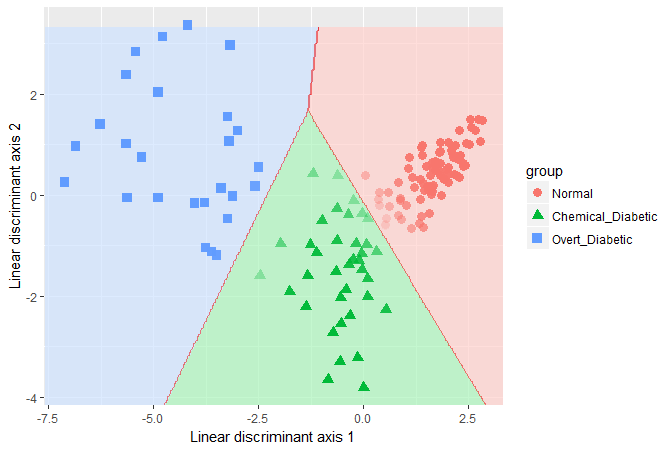
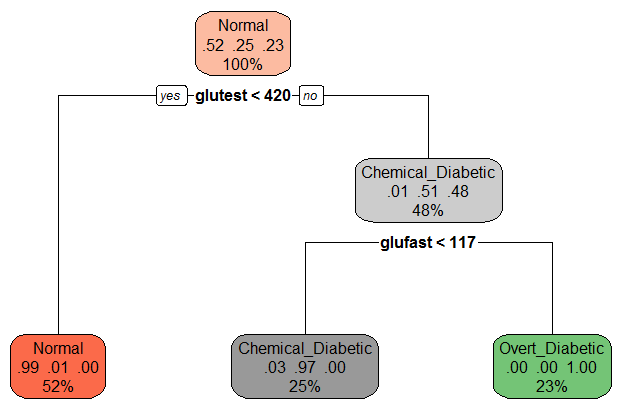

```{r echo=FALSE}
knitr::opts_chunk$set(warning=FALSE, message=FALSE, collapse=TRUE, R.options=list(digits=4))
```

## Background


Reaven and Miller (1979) examined the relationship among blood chemistry measures of glucose tolerance and insulin in 145 nonobese adults. They used the PRIM9 system at the Stanford Linear Accelerator Center to visualize the data in 3D, and discovered a peculiar pattern that looked like a large blob with two wings in different directions.

After further analysis, the subjects were classified as sub-clinical (chemical) diabetics, overt diabetics and normals. This study was influential in defining the stages of development of Type 2 diabetes. Overt diabetes is the most advanced stage, characterized by elevated fasting blood glucose concentration and classical symptoms. Preceding overt diabetes is the latent or chemical diabetic stage, with no symptoms of diabetes but demonstrable abnormality of oral or intravenous glucose tolerance.

The `Diabetes` data set is contained in the `heplots` package.  This vignette uses these data  to illustrate various graphical methods for multivariate linear models. As we'll see, the data is peculiar in several respects and a standard MANOVA
is problematic because some assumptions are violated.  We treat this as a learning opportunity, because it allows us
to illustrate several diagnostic plots.
Some of the content here serves as an additional example for a recent paper on visualizing tests for equality of variance in
MANOVA (Friendly & Sigal, 2017).

### Setting up
Load the required packages and the data
```{r setup}
library(heplots)
library(candisc)
library(car)
```
```{r}
data(Diabetes, package="heplots")
str(Diabetes)
```

The variables are:

* `relwt`: relative weight, expressed as the ratio of actual weight to expected weight, given the person's height
* `glufast`: fasting plasma glucose level
* `glutest`: test plasma glucose level, a measure of glucose intolerance,
* `instest`: plasma insulin during test, a measure of insulin response to oral glucose,
* `sspg`: steady state plasma glucose, a measure of insulin resistance
* `group`: diagnostic group

`relwt` is not used in this example, but that is not for any principled reason.

## Data ellipsoids and homogeneity of variance
We start by plotting covariance ellipses for three of the variables in the data set.
`heplots::covEllipses` is similar to `dataEllipse` in the `car` package, but tuned
to plots designed to assess homogeneity of covariance matrices in MANOVA designs.

It is clear from this that there is a problem of heterogeneity of variance-covariance matrices here.
The normal group shows the smallest variances and the overt diabetic group the largest.
```{r covEllipse, fig.height=5, fig.width=5}
covEllipses(Diabetes[,2:5], Diabetes$group, fill=TRUE, pooled=FALSE, 
	col=c("blue", "red", "darkgreen"), variables=1:3)
```

As well, the plot suggests something more interesting about the difference between
the overt and chemical diabetes groups. In the panel for `glufast` and `glutest`,
there appears to be a direct progression from normal to chemical to overt.
However, this is not true in the other panels, where the chemical diabetes group
differs from the normals in one direction, while the overt group differs in a different
direction and has a within-group correlation opposite in sign to the others.
This can be seen more easily in individual scatterplots, such as that below
(using `car::scatterplot`).

```{r scatter, fig.width=6, fig.height=5, echo=-1}
op <- par(mar=c(4,4,0,1)+.5)
scatterplot( instest ~ glutest | group, data=Diabetes, 
             pch=c(16,15,17), 
             col=c("blue", "red", "darkgreen"),
             smooth=FALSE, 
             grid=FALSE, 
             legend=list(coords="topright"), 
             lwd=2,
             ellipse=list(levels=0.5))
```

This insight was part of the reason that Reaven and Miller
concluded that chemical diabetes and overt diabetes reflected different disease regimes, rather than
an increasing progression of severity.

As an aside, we note that the differences among the groups can be readily seen in 3D using `scatter3d` in the `car` package.
```{r scatter3d, eval=FALSE}
scatter3d(sspg ~ glutest + instest | group, data=Diabetes, 
          surface=FALSE,	sphere.size=1.5, ellipsoid=TRUE,
          surface.col=c("blue", "red", "darkgreen"))
```



### Box's M test
Box's M test confirms that there is substantial heterogeneity of covariance matrices.  The `plot` method for the result gives a convenient and informative display of how the groups differ in the components ($log | S_i |$) that go into Box's M test.

```{r boxm, fig.width=7, fig.height=3}
diab.boxm <- boxM(Diabetes[,2:5], Diabetes$group)
diab.boxm

op <- par(mar=c(4,6,1,1)+.5)
plot(diab.boxm, cex.lab=1.5)
```

The log determinants are ordered according to the sizes of the data ellipses we saw in the
covariance ellipse plots.

## Fit the MLM
We ignore this problem for the sake of this example, and proceed to fit the MANOVA model for the mean differences
among groups.

The MANOVA shows a highly significant effect of `group` on the collection of response variables.

```{r diab-mlm}
diab.mlm <- lm(cbind(glufast, glutest, instest, sspg) ~ group, data=Diabetes)
Anova(diab.mlm)
```

### Examine residuals in a QQ plot

Another assumption of MANOVA is that the residuals have a multivariate normal distribution.
This can be assessed visually with a Chi-square QQ plot. This plots 
squared Mahalanobis distances ($D^2$) of the residuals vs. corresponding quantiles of the 
$\chi^2$ distribution with $p$ degrees of freedom.
The `cqplot` function in the `heplots` package is designed to do this from a fitted
MLM object. A confidence envelope makes it easy to see when the departure
is large enough to cause concern.

It can be seen here that the points differ substantially from the red line
of equality.  There are far too many points with large $D^2$ values.

```{r cqplot, fig.width=6, fig.height=5}
cqplot(diab.mlm)
```

## HE plots

An HE plot shows the $H$ ellipse for differences among means together with the $E$ ellipse for error.
In the default scaling, such plots have the visual property that a given effect in
the MLM is significant (by Roy's maximum root test) *iff* the $H$ ellipse projects **anywhere** outside
the $E$ ellipse.

By default, the first two response variables are plotted.
The result shows that the means on both `glufast` and `glutest` are ordered
`Normal < Chemical < Overt`.

```{r he1, fig.width=6, fig.height=5, echo=-1}
op <- par(mar=c(4,4,1,1)+.5)
heplot(diab.mlm, fill=TRUE, fill.alpha=0.1)
```

The `pairs` method for an MLM gives a scatterplot matrix of HE plots for all pairs of response variables.
The pattern for `instest` seems to differ from the other variables.

```{r he2, fig.width=5, fig.height=5}
pairs(diab.mlm, fill=TRUE, fill.alpha=0.1)
```

## Canonical discriminant analysis

Canonical discriminant analysis effectively projects the data into the space
of linear combinations of the responses that accounts for the greatest
proportion of the between-group variance relative to within-group variance.

In this case, with $g=3$ groups, this space is two-dimensional, so all differences
can be seen in a 2D plot.  From the output below, nearly 90% of between-group
mean differences are accounted for by the first canonical dimension.
Both canonical dimensions are significant, by a likelihood ratio stepdown test.

```{r diab-can}
diab.can <- candisc(diab.mlm)
diab.can
```

### Canonical discriminant plot
The `plot` method for a `candisc` object plots the scores on the canonical dimensions and overlays
60% data ellipses for each group. The positions of the group means show the the means on
the canonical dimensions.

The relationship of the response variables to the canonical dimensions
is shown by vectors (similar to a biplot).  Each vector is defined by the correlations
(structure coefficients) it has with the canonical dimensions.^[The structure coefficients determine 
only the angle of the vector with respect to the coordinate
axes.  The vectors are all multiplied by a scale factor, chosen so the vectors nearly fill the
plot frame.]

```{r diab-can-plot, fig.width=6, fig.height=4, echo=-1}
op <- par(mar=c(4,4,0,1)+.5)
plot(diab.can, ellipse=TRUE, var.lwd=2)
```

In this plot it can be seen that: 

* Dimension 1 is highly related to `glufast`, `glutest` and `sspg`,
and the groups are ordered `Normal < Chemical < Overt`.

* Dimension 2 distinguishes the `Chemical_Diabetic` group from the other two.
This dimension is largely related to `instest`, the plasma insulin during test.
This confirms what we saw in the HE plot matrix for all the responses.

* The relative sizes of the data ellipses for the canonical scores is another visual indication
of the lack of heterogeneity of variances.

### Canonical HE plot

The `heplot` method for `candisc` objects gives an HE plot summary of the canonical
discriminant analysis. The variable vectors are the same as in the canonical
structure plot. The size of the $H$ ellipse relative to that of the $E$ ellipse
is an indication of the magnitude of the multivariate effect for `group`.

```{r diab-heplot, , fig.width=6, fig.height=4, echo=-1}
op <- par(mar=c(4,4,0,1)+.5)
heplot(diab.can, fill=c(TRUE, FALSE), fill.alpha=0.1, var.lwd=2)
```

## Other analyses

There are other methods that could be used to analyze these data and display the results visually.
We merely sketch some alternatives here.

### Linear and quadratic discriminant analysis

Linear discriminant analysis (LDA) is similar in spirit to MANOVA, but the emphasis is on classification rather than on 
testing differences among means.  As well, LDA allows specification of the 
prior probabilities of group membership to make classification error rates comparable
to what would be obtained in a population of interest.
Quadratic discriminant analysis allows for differences in the covariance matrices among groups,
and gives quadratic rather then linear classification boundaries.

LDA is in some sense equivalent to our canonical discriminant analysis. A simple function for this is
`lda` in the `MASS` package. This gives the same class means and the same variance proportions as
`candisc`.  However, here, the prior probabilities are taken from the proportions of the groups
in the data.

```{r diab-lda}
library(MASS)
diab.lda <- lda(group ~ glufast + glutest + instest + sspg, data = Diabetes)
diab.lda
```

From the LDA perspective, one goal in visualizing the results is to see the boundaries of classification
based on the `LD1` and `LD2` scores.  The plot shown here was produced with `ggplot2`, following a method
described in [this stackoverflow question](https://stackoverflow.com/questions/31893423/r-plotting-posterior-classification-probabilities-of-a-linear-discriminant-anal).  What is missing here is any indication of how this relates to the response variables.




Quadratic discriminant analysis can be carried out in a similar way, using the `qda` function.
The results are not shown.


### Recursive partitioning

Recursive partitioning is a method that
creates a decision tree designed to classify the members of a population.
It recursively splits the data into sub-populations using dichotomous intervals of the predictors.
One strength of the method is that it is nicely tied to *cross-validation*, where a sample is
repeatedly split into training and test samples, and the model fit to each training sample is
assessed on the test sample.

For the diabetes data, the result is very simple: A value of `glutest < 420` distinguishes
normals from the two clinical groups. For the latter, `glufast < 117` classifies an individual
as chemical diabetic rather than overt diabetic.
```{r rpart}
library(rpart)
diab.part <- rpart(group ~ glufast + glutest + instest + sspg, data=Diabetes)
diab.part
```

A nice plot of the partition tree is produced using the `rpart.plot` package.
The numbers in the nodes give the proportions classified in each of the three
groups.
```{r rpart-plot, eval=FALSE}
library(rpart.plot)
rpart.plot(diab.part, box.palette=list("Blues", "Reds",  "Greens"))
```




How well does that do? We can examine a table of predicted group membership vs. actual and calculate the error rate.
Not too bad!

```{r}
(class.pred <- table(predicted=predict(diab.part, type="class"), actual=Diabetes$group))

# error rate
1 - sum(diag(class.pred))/sum(class.pred)
```


## References

Friendly, M. & Sigal, M. (2017) Visualizing Tests of Equality of Covariance Matrices.
Submitted for publication. \url{http://datavis.ca/papers/}

Reaven, G. M. & Miller, R. G. (1979).
An Attempt to Define the Nature of Chemical Diabetes Using a Multidimensional Analysis 
*Diabetologia*, **16**, 17-24.